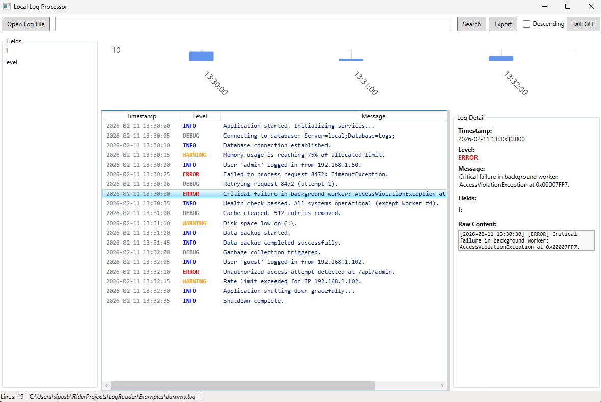
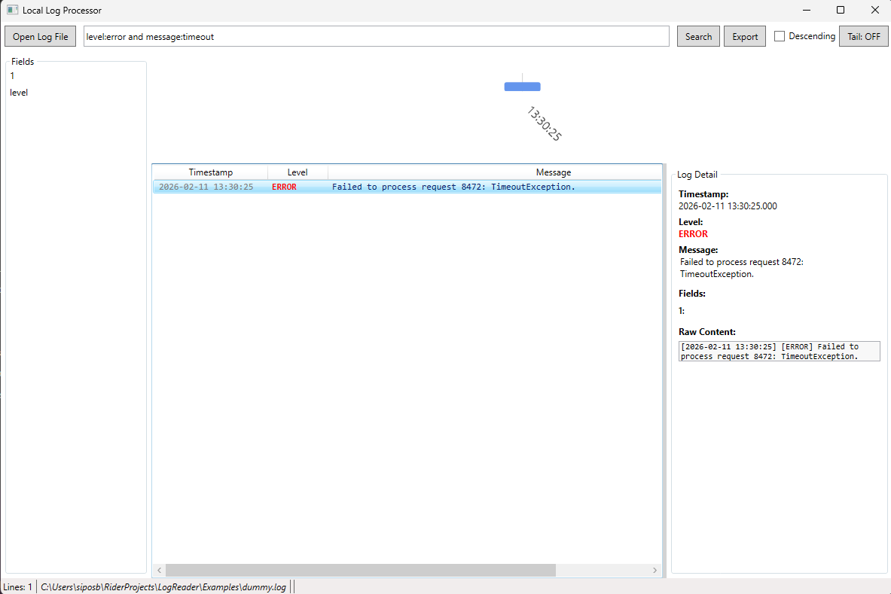

# Local Log Processor (LLP)

Local Log Processor (LLP) is a high-performance, lightweight log analysis tool for Windows. It is designed to handle multi-gigabyte log files with ease, providing instant search and real-time monitoring capabilities.

**Note: This project is 100% AI-coded.**

## 🚀 Key Features



- **Large File Support**: Leverages Memory-Mapped Files (MMF) to open and browse multi-gigabyte files instantly without consuming excessive RAM.
- **Near-Instant Search**: Powered by SQLite FTS5 for high-speed full-text and field-specific indexing.
- **Kibana-like Query Language**: Supports a powerful search syntax including:
    - Full-text search
    - Field-specific filters (e.g., `level:ERROR`)
    - Logical operators (`AND`, `OR`, `NOT`)
    - Comparison operators for timestamps and numbers (e.g., `status:>400`, `timestamp:<2024-01-01`)
- **Real-Time Monitoring (Tail -f)**: Watch logs in real-time as they are written to disk.
- **Structured Parsing**: Automatic detection and parsing of JSON logs and common Regex-based formats.
- **Log Visualizations**: Built-in histogram to visualize log frequency over time.
- **Rich Log Details**: Detailed inspection of log entries, including extracted fields and raw content.
- **Export Capabilities**: Export filtered logs to CSV or JSON formats.

## 🛠 Technology Stack

- **Framework**: .NET 10
- **UI**: WPF (Windows Presentation Foundation)
- **Database/Indexing**: SQLite with FTS5 extension
- **Core Techniques**: Memory-Mapped Files, Background Indexing, UI Virtualization

## 🏁 Getting Started

### Prerequisites

- [.NET 10 SDK](https://dotnet.microsoft.com/download/dotnet/10.0)

### Building the Project

To build the solution, run the following command in the project root:

```powershell
dotnet build LLP.sln
```

### Running the Application

You can run the UI project directly:

```powershell
dotnet run --project LLP.UI\LLP.UI.csproj
```

### Creating a Portable Executable

To create a single-file, self-contained portable build for Windows:

```powershell
dotnet publish LLP.UI\LLP.UI.csproj -c Release -r win-x64 --self-contained true /p:PublishSingleFile=true /p:PublishReadyToRun=true /p:IncludeNativeLibrariesForSelfExtract=true
```

The executable will be located at:
`LLP.UI\bin\Release\net10.0-windows\win-x64\publish\LLP.UI.exe`

## 🔍 Search Syntax Examples



| Query | Description |
|---|---|
| `error` | Finds any line containing "error" |
| `level:ERROR` | Finds logs where the level field is "ERROR" |
| `level:WARN OR level:ERROR` | Finds warnings or errors |
| `NOT database` | Excludes lines containing "database" |
| `status:>=500` | Finds logs with a status code of 500 or higher |
| `timestamp:>2024-02-01` | Finds logs after a specific date |

## 📖 Documentation

For more detailed information, please refer to the [User Manual](docs/user-manual.md).
